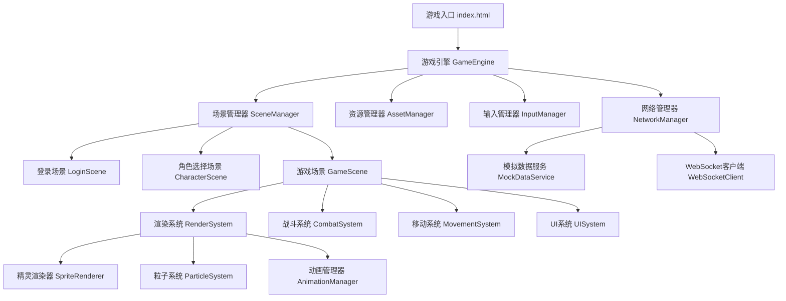

# 设计文档

## 概述

本文档描述了HTML5即时战斗MMRPG游戏的前端架构设计。游戏采用模块化架构，使用Canvas 2D API进行渲染，通过事件驱动的方式处理游戏逻辑。设计重点关注可扩展性、性能优化和与未来WebSocket后端的兼容性。

## 技术栈

- **HTML5 Canvas**: 游戏渲染
- **TypeScript/JavaScript**: 游戏逻辑
- **CSS3**: UI样式
- **WebSocket API**: 预留后端通信接口（当前使用模拟实现）

## 架构

### 整体架构图



### 核心模块

#### 1. 游戏引擎 (GameEngine)

游戏引擎是整个应用的核心，负责初始化、游戏循环和模块协调。

**职责:**
- 初始化Canvas和渲染上下文
- 管理游戏循环（60 FPS）
- 协调各个子系统
- 处理窗口大小变化

**关键方法:**
- `init()`: 初始化引擎
- `start()`: 启动游戏循环
- `update(deltaTime)`: 更新游戏状态
- `render()`: 渲染游戏画面
- `resize()`: 处理窗口大小变化

#### 2. 场景管理器 (SceneManager)

管理不同游戏场景的切换和生命周期。

**职责:**
- 场景注册和切换
- 场景生命周期管理（enter, update, render, exit）
- 场景转场效果

**场景类型:**
- `LoginScene`: 登录界面
- `CharacterScene`: 角色创建/选择界面
- `GameScene`: 主游戏场景

#### 3. 资源管理器 (AssetManager)

负责加载和管理游戏资源。

**职责:**
- 异步加载图片、音频资源
- 资源缓存和引用计数
- 加载进度跟踪

**资源类型:**
- 精灵图集（角色、敌人、技能特效）
- UI图标和界面元素
- 音效和背景音乐

#### 4. 输入管理器 (InputManager)

统一处理键盘、鼠标输入。

**职责:**
- 监听键盘事件（WASD、技能快捷键）
- 监听鼠标事件（点击、移动）
- 输入状态管理
- 输入映射配置

#### 5. 网络管理器 (NetworkManager)

处理客户端与服务器通信，当前使用模拟实现。

**职责:**
- WebSocket连接管理
- 消息序列化/反序列化
- 模拟数据服务切换
- 消息队列和重连机制

## 组件和接口

### 实体组件系统 (ECS)

游戏采用简化的ECS架构来管理游戏对象。

#### Entity（实体）

```typescript
interface Entity {
  id: string;
  type: 'player' | 'enemy' | 'npc';
  components: Map<string, Component>;
}
```

#### 核心组件

**TransformComponent（变换组件）**
```typescript
interface TransformComponent {
  position: { x: number; y: number };
  rotation: number;
  scale: { x: number; y: number };
}
```

**SpriteComponent（精灵组件）**
```typescript
interface SpriteComponent {
  spriteSheet: string;
  currentAnimation: string;
  frame: number;
  animations: Map<string, Animation>;
}
```

**StatsComponent（属性组件）**
```typescript
interface StatsComponent {
  hp: number;
  maxHp: number;
  mp: number;
  maxMp: number;
  attack: number;
  defense: number;
  speed: number;
  level: number;
  exp: number;
}
```

**CombatComponent（战斗组件）**
```typescript
interface CombatComponent {
  target: Entity | null;
  attackRange: number;
  attackCooldown: number;
  lastAttackTime: number;
  skills: Skill[];
}
```

**MovementComponent（移动组件）**
```typescript
interface MovementComponent {
  velocity: { x: number; y: number };
  speed: number;
  path: { x: number; y: number }[];
  isMoving: boolean;
}
```

### 系统接口

所有系统实现统一接口：

```typescript
interface System {
  update(deltaTime: number, entities: Entity[]): void;
  render?(ctx: CanvasRenderingContext2D, entities: Entity[]): void;
}
```

### 渲染系统 (RenderSystem)

**职责:**
- 渲染所有可见实体
- 视锥剔除优化
- 图层排序（背景、实体、UI）
- 相机跟随

**渲染流程:**
1. 清空Canvas
2. 渲染背景层
3. 计算可见实体
4. 按Y坐标排序（实现深度效果）
5. 渲染实体精灵
6. 渲染粒子特效
7. 渲染UI层

### 战斗系统 (CombatSystem)

**职责:**
- 目标选择和锁定
- 攻击范围检测
- 伤害计算
- 技能释放逻辑
- 战斗状态管理

**战斗流程:**
1. 检测玩家输入（点击敌人、技能按键）
2. 验证攻击条件（范围、冷却、资源）
3. 执行攻击/技能
4. 计算伤害（基于属性和技能数据）
5. 应用效果（伤害、buff/debuff）
6. 更新UI（生命值、冷却显示）
7. 检测死亡状态

**技能数据结构:**
```typescript
interface Skill {
  id: string;
  name: string;
  icon: string;
  cooldown: number;
  manaCost: number;
  castTime: number;
  range: number;
  damage: number;
  effects: SkillEffect[];
  animation: string;
}
```

### 移动系统 (MovementSystem)

**职责:**
- 键盘移动处理
- 点击移动路径计算
- 碰撞检测
- 相机跟随

**移动模式:**
- **键盘模式**: WASD直接控制方向
- **点击模式**: A*寻路算法计算路径

**碰撞检测:**
- 使用简单的AABB（轴对齐包围盒）
- 地图障碍物数据结构
- 实体间碰撞检测

### UI系统 (UISystem)

**职责:**
- 渲染游戏UI元素
- 处理UI交互
- UI动画和过渡效果

**UI组件:**

**生命值条 (HealthBar)**
```typescript
interface HealthBar {
  position: { x: number; y: number };
  width: number;
  height: number;
  currentValue: number;
  maxValue: number;
  color: string;
}
```

**技能栏 (SkillBar)**
- 显示4-6个技能图标
- 冷却遮罩动画
- 快捷键提示
- 魔法值不足提示

**目标框架 (TargetFrame)**
- 目标名称
- 生命值条
- 等级显示

**小地图 (Minimap)**
- 简化的地图视图
- 玩家位置标记
- 敌人位置标记
- 可点击导航

## 数据模型

### 角色数据模型

```typescript
interface Character {
  id: string;
  name: string;
  class: 'warrior' | 'mage' | 'archer';
  level: number;
  exp: number;
  stats: {
    hp: number;
    maxHp: number;
    mp: number;
    maxMp: number;
    attack: number;
    defense: number;
    speed: number;
  };
  skills: string[]; // 技能ID列表
  equipment: {
    weapon?: string;
    armor?: string;
    accessory?: string;
  };
  position: { x: number; y: number };
}
```

### 敌人数据模型

```typescript
interface Enemy {
  id: string;
  templateId: string; // 引用敌人模板
  name: string;
  level: number;
  stats: {
    hp: number;
    maxHp: number;
    attack: number;
    defense: number;
    speed: number;
  };
  aiType: 'passive' | 'aggressive' | 'patrol';
  position: { x: number; y: number };
  lootTable: LootItem[];
}
```

### 地图数据模型

```typescript
interface GameMap {
  id: string;
  name: string;
  width: number;
  height: number;
  tileSize: number;
  layers: {
    background: number[][];
    collision: boolean[][];
    decoration: number[][];
  };
  spawnPoints: {
    player: { x: number; y: number };
    enemies: EnemySpawn[];
  };
}
```

## 模拟数据服务

### MockDataService

提供所有游戏数据的模拟实现。

**数据类别:**
- 角色模板数据
- 敌人模板数据
- 技能数据
- 地图数据
- 装备数据

**模拟WebSocket消息:**

```typescript
interface MockMessage {
  type: 'login' | 'move' | 'attack' | 'skill' | 'damage' | 'death';
  data: any;
  timestamp: number;
}
```

**模拟延迟:**
- 模拟网络延迟（50-150ms）
- 模拟服务器响应时间

**配置切换:**
```typescript
const config = {
  useMockData: true, // true: 使用模拟数据, false: 连接真实服务器
  mockDelay: 100, // 模拟延迟（毫秒）
  serverUrl: 'ws://localhost:8080' // 真实服务器地址
};
```

## 动画系统

### AnimationManager

管理精灵动画播放。

**动画数据结构:**
```typescript
interface Animation {
  name: string;
  frames: number[];
  frameRate: number;
  loop: boolean;
}
```

**动画状态机:**
- idle（待机）
- walk（行走）
- attack（攻击）
- skill（技能）
- hit（受击）
- death（死亡）

### ParticleSystem

粒子特效系统，用于技能特效和环境效果。

**粒子类型:**
- 技能释放特效
- 伤害数字飘字
- 治疗特效
- 升级特效
- 环境粒子（雪花、火花等）

**粒子数据:**
```typescript
interface Particle {
  position: { x: number; y: number };
  velocity: { x: number; y: number };
  life: number;
  maxLife: number;
  size: number;
  color: string;
  alpha: number;
}
```

## 错误处理

### 错误类型

1. **资源加载错误**
   - 显示友好错误提示
   - 提供重试选项
   - 降级到默认资源

2. **网络错误**
   - 自动重连机制（最多3次）
   - 显示连接状态
   - 离线模式提示

3. **游戏逻辑错误**
   - 捕获异常并记录
   - 尝试恢复游戏状态
   - 严重错误时返回主菜单

### 日志系统

```typescript
enum LogLevel {
  DEBUG,
  INFO,
  WARN,
  ERROR
}

class Logger {
  log(level: LogLevel, message: string, data?: any): void;
}
```

## 性能优化策略

### 渲染优化

1. **视锥剔除**: 只渲染屏幕可见区域的实体
2. **脏矩形**: 只重绘变化的区域（可选）
3. **图层缓存**: 静态背景使用离屏Canvas缓存
4. **精灵批处理**: 合并相同纹理的绘制调用

### 内存优化

1. **对象池**: 复用频繁创建的对象（粒子、伤害数字）
2. **资源释放**: 场景切换时释放不需要的资源
3. **纹理图集**: 合并小图片减少内存占用

### 逻辑优化

1. **空间分区**: 使用四叉树管理实体，加速碰撞检测
2. **事件驱动**: 避免每帧轮询，使用事件通知
3. **增量更新**: 只更新变化的数据

### 性能监控

```typescript
interface PerformanceMetrics {
  fps: number;
  frameTime: number;
  entityCount: number;
  drawCalls: number;
  memoryUsage: number;
}
```

## 测试策略

### 单元测试

- 工具函数测试（数学计算、碰撞检测）
- 数据模型验证
- 系统逻辑测试

### 集成测试

- 场景切换流程
- 战斗系统完整流程
- 模拟数据服务与系统集成

### 性能测试

- 大量实体渲染测试
- 长时间运行稳定性测试
- 内存泄漏检测

### 兼容性测试

- 主流浏览器测试（Chrome, Firefox, Safari, Edge）
- 不同分辨率测试
- 移动端触摸支持测试

## 未来扩展

### WebSocket集成

当后端就绪时，需要实现：

1. **连接管理**
   - 建立WebSocket连接
   - 心跳保活
   - 断线重连

2. **消息协议**
   - 定义客户端-服务器消息格式
   - 消息序列化（JSON或二进制）
   - 消息压缩

3. **状态同步**
   - 客户端预测
   - 服务器权威
   - 状态插值

### 多人在线功能

- 其他玩家实体渲染
- 聊天系统
- 组队系统
- PVP战斗

### 高级功能

- 背包和物品系统
- 任务系统
- 商店系统
- 公会系统
