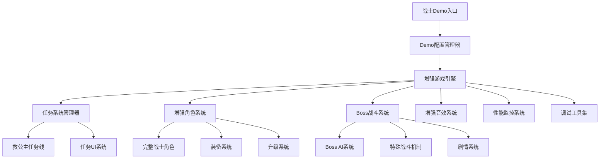

# 战士Demo设计文档

## 概述

本文档描述了完整战士角色测试性demo的设计架构。该demo基于现有的HTML5 MMRPG游戏框架，专门展示战士职业的所有功能，包含完整的技能系统、救公主任务线、丰富的战斗体验和调试工具。设计重点关注可玩性、功能完整性和性能优化。

## 架构

### 整体架构图



### 核心模块扩展

#### 1. Demo配置管理器 (DemoConfigManager)

管理demo的特殊配置和初始化参数。

**职责:**
- 配置高等级战士角色参数
- 设置demo专用的地图和敌人配置
- 管理任务系统的初始状态
- 配置调试工具的可用性

**关键方法:**
- `initWarriorDemo()`: 初始化战士demo配置
- `createDemoCharacter()`: 创建demo专用的高等级战士
- `setupDemoMap()`: 设置包含boss的demo地图
- `enableDebugTools()`: 启用调试工具

#### 2. 任务系统管理器 (QuestManager)

管理救公主任务线和相关的游戏逻辑。

**职责:**
- 管理任务状态和进度
- 处理任务触发条件
- 管理剧情播放
- 更新任务UI显示

**任务状态:**
- `NOT_STARTED`: 任务未开始
- `INTRO_PLAYING`: 播放开场剧情
- `ACTIVE`: 任务进行中
- `BOSS_FIGHT`: Boss战斗阶段
- `COMPLETED`: 任务完成
- `VICTORY_SCENE`: 胜利剧情播放

#### 3. Boss战斗系统 (BossSystem)

专门处理boss战斗的特殊机制。

**职责:**
- 管理boss的特殊AI行为
- 处理boss的多阶段战斗
- 管理boss区域的特殊效果
- 触发胜利条件检测

**Boss特殊机制:**
- 多阶段血量系统
- 特殊技能和攻击模式
- 区域AOE攻击
- 召唤小怪机制

#### 4. 增强角色系统 (EnhancedCharacterSystem)

扩展现有角色系统，支持更丰富的功能。

**职责:**
- 管理角色升级和属性成长
- 处理装备系统逻辑
- 管理技能解锁和升级
- 处理角色死亡和复活

**新增功能:**
- 自动升级机制
- 装备自动配置
- 技能熟练度系统
- 复活点管理

## 组件和接口

### 任务系统组件

#### Quest（任务）

```typescript
interface Quest {
  id: string;
  name: string;
  description: string;
  type: 'main' | 'side';
  status: QuestStatus;
  objectives: QuestObjective[];
  rewards: QuestReward[];
  cutscenes: Cutscene[];
}
```

#### QuestObjective（任务目标）

```typescript
interface QuestObjective {
  id: string;
  description: string;
  type: 'kill' | 'reach' | 'collect' | 'interact';
  target: string;
  currentCount: number;
  requiredCount: number;
  completed: boolean;
}
```

### Boss系统组件

#### Boss（Boss实体）

```typescript
interface Boss extends Entity {
  phases: BossPhase[];
  currentPhase: number;
  specialAbilities: SpecialAbility[];
  defeatConditions: DefeatCondition[];
  lootTable: BossLoot[];
}
```

#### BossPhase（Boss阶段）

```typescript
interface BossPhase {
  id: string;
  name: string;
  healthThreshold: number;
  abilities: string[];
  behaviorPattern: AIPattern;
  phaseTransitionEffect: string;
}
```

### 装备系统组件

#### Equipment（装备）

```typescript
interface Equipment {
  id: string;
  name: string;
  type: 'weapon' | 'armor' | 'accessory';
  rarity: 'common' | 'rare' | 'epic' | 'legendary';
  stats: EquipmentStats;
  requirements: EquipmentRequirements;
  effects: EquipmentEffect[];
}
```

#### EquipmentStats（装备属性）

```typescript
interface EquipmentStats {
  attack?: number;
  defense?: number;
  hp?: number;
  mp?: number;
  speed?: number;
  criticalRate?: number;
  criticalDamage?: number;
}
```

## 数据模型

### 战士Demo角色数据

```typescript
interface WarriorDemoCharacter extends Character {
  level: 20; // 高等级开始
  stats: {
    hp: 500;
    maxHp: 500;
    mp: 200;
    maxMp: 200;
    attack: 50;
    defense: 30;
    speed: 120;
  };
  skills: [
    'basic_attack',
    'warrior_slash',
    'warrior_charge',
    'warrior_defense',
    'warrior_whirlwind', // 新增技能
    'warrior_berserker'   // 新增技能
  ];
  equipment: {
    weapon: 'legendary_sword';
    armor: 'plate_armor';
    accessory: 'warrior_ring';
  };
  questProgress: QuestProgress;
}
```

### Boss数据模型

```typescript
interface DragonBoss extends Boss {
  id: 'dragon_boss';
  name: '邪恶巨龙';
  level: 25;
  stats: {
    hp: 2000;
    maxHp: 2000;
    attack: 80;
    defense: 40;
    speed: 60;
  };
  phases: [
    {
      id: 'phase_1',
      name: '愤怒阶段',
      healthThreshold: 1.0,
      abilities: ['fire_breath', 'claw_attack', 'tail_sweep']
    },
    {
      id: 'phase_2',
      name: '狂暴阶段',
      healthThreshold: 0.5,
      abilities: ['meteor_strike', 'summon_minions', 'rage_mode']
    },
    {
      id: 'phase_3',
      name: '绝望阶段',
      healthThreshold: 0.2,
      abilities: ['ultimate_fire_storm', 'desperate_charge']
    }
  ];
}
```

### 任务数据模型

```typescript
interface RescuePrincessQuest extends Quest {
  id: 'rescue_princess';
  name: '拯救公主';
  description: '邪恶的巨龙抢走了公主，勇敢的战士必须前往龙穴救出她！';
  type: 'main';
  objectives: [
    {
      id: 'reach_dragon_lair',
      description: '前往巨龙巢穴',
      type: 'reach',
      target: 'dragon_lair_entrance'
    },
    {
      id: 'defeat_dragon',
      description: '击败邪恶巨龙',
      type: 'kill',
      target: 'dragon_boss'
    },
    {
      id: 'rescue_princess',
      description: '救出公主',
      type: 'interact',
      target: 'princess_npc'
    }
  ];
  cutscenes: [
    {
      id: 'intro_cutscene',
      trigger: 'quest_start',
      script: 'princess_kidnapped.json'
    },
    {
      id: 'victory_cutscene',
      trigger: 'quest_complete',
      script: 'princess_rescued.json'
    }
  ];
}
```

## 正确性属性

*属性是一个特征或行为，应该在系统的所有有效执行中保持为真——本质上是关于系统应该做什么的正式声明。属性作为人类可读规范和机器可验证正确性保证之间的桥梁。*

### 角色系统属性

**属性 1: 战士角色完整性**
*对于任何*创建的战士demo角色，该角色应该拥有所有预定义的战士技能和高等级属性
**验证: 需求 1.2, 1.3**

**属性 2: 技能响应一致性**
*对于任何*有效的技能快捷键输入，如果角色满足释放条件，则应该正确触发对应的技能
**验证: 需求 2.1, 2.5**

**属性 3: 技能冷却准确性**
*对于任何*释放的技能，其冷却时间显示应该准确反映实际的冷却状态
**验证: 需求 2.4**

### 战斗系统属性

**属性 4: 伤害计算一致性**
*对于任何*技能攻击，显示的伤害数值应该与实际应用到目标的伤害值一致
**验证: 需求 2.3**

**属性 5: 敌人重生连续性**
*对于任何*被击败的敌人，在指定时间内应该有新的敌人生成以保持战斗连续性
**验证: 需求 3.2**

**属性 6: 经验奖励一致性**
*对于任何*被击败的敌人，玩家应该获得与该敌人等级相对应的经验值奖励
**验证: 需求 3.5, 7.1**

### 任务系统属性

**属性 7: 任务进度同步**
*对于任何*任务目标的完成，任务UI显示的进度应该与实际游戏状态保持同步
**验证: 需求 6.2**

**属性 8: Boss战斗机制完整性**
*对于任何*与boss的战斗，应该包含所有预定义的特殊战斗机制和阶段转换
**验证: 需求 6.4**

### 性能系统属性

**属性 9: 帧率稳定性**
*对于任何*正常游戏场景，游戏应该维持在目标帧率范围内的稳定性能
**验证: 需求 5.1, 5.2**

**属性 10: 内存使用稳定性**
*对于任何*长时间的游戏会话，内存使用量应该保持在合理范围内，不出现持续增长
**验证: 需求 5.3**

### UI系统属性

**属性 11: 状态显示准确性**
*对于任何*角色状态的变化，UI显示应该准确反映当前的实际状态
**验证: 需求 4.1, 4.3**

**属性 12: 技能可用性指示**
*对于任何*技能的可用状态变化，技能栏应该正确显示该技能的可用性
**验证: 需求 4.2**

### 音效系统属性

**属性 13: 音效触发一致性**
*对于任何*游戏事件，应该播放与该事件类型相对应的音效
**验证: 需求 9.1, 9.2, 9.3, 9.4**

**属性 14: 动态音乐切换**
*对于任何*游戏状态的改变（如进入战斗、接近boss），背景音乐应该相应地切换
**验证: 需求 6.3, 9.5**

## 错误处理

### Demo特定错误处理

1. **角色创建失败**
   - 回退到默认战士配置
   - 显示警告信息但继续游戏
   - 记录错误日志供调试

2. **任务系统错误**
   - 任务状态不一致时自动修复
   - 剧情播放失败时提供跳过选项
   - Boss战斗异常时重置战斗状态

3. **性能降级处理**
   - 自动降低特效质量
   - 减少同时显示的敌人数量
   - 启用性能优化模式

## 测试策略

### 双重测试方法

本设计采用单元测试和基于属性的测试相结合的方法：

- **单元测试**验证具体示例、边缘情况和错误条件
- **属性测试**验证应该在所有输入中保持的通用属性
- 两者结合提供全面覆盖：单元测试捕获具体错误，属性测试验证一般正确性

### 单元测试要求

单元测试涵盖：
- 战士角色创建的具体示例
- 特定技能释放的边缘情况
- Boss战斗的各个阶段转换
- 任务系统的状态转换

### 基于属性的测试要求

- 使用**Vitest**作为属性测试框架
- 每个属性测试配置运行最少**100次迭代**
- 每个属性测试必须用注释明确引用设计文档中的正确性属性
- 使用格式：'**Feature: warrior-demo, Property {number}: {property_text}**'
- 每个正确性属性必须由单个属性测试实现

### 测试生成器策略

为属性测试编写智能生成器：
- **角色生成器**: 生成各种等级和配置的战士角色
- **技能输入生成器**: 生成有效和无效的技能输入组合
- **战斗场景生成器**: 生成不同的敌人配置和战斗情况
- **任务状态生成器**: 生成各种任务进度状态

## 未来扩展

### 多职业支持

当需要扩展到其他职业时：

1. **职业系统抽象化**
   - 将战士特定逻辑抽象为通用职业接口
   - 创建职业工厂模式
   - 支持职业间的平衡性测试

2. **技能系统扩展**
   - 支持职业特有的技能树
   - 实现技能组合和连击系统
   - 添加职业间的协作机制

### 多人模式准备

- 网络同步的战斗系统
- 多人任务协作机制
- 服务器端的Boss战斗验证

### 内容扩展

- 更多Boss和任务线
- 装备强化和制作系统
- 成就和收集系统