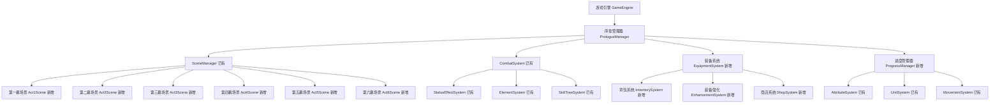

# 设计文档 - 张角黄巾起义序章

## 概述

本设计文档描述了"张角黄巾起义序章"的技术实现方案。序章是一个动作RPG游戏，包含完整的游戏机制（移动、战斗、装备、技能）和六幕剧情。设计采用ECS（Entity-Component-System）架构，充分复用现有游戏引擎功能，通过数据驱动的方式配置游戏内容。

## 架构

### 整体架构图



### 已有引擎功能（充分复用）

**核心系统:**
- ✅ SceneManager - 场景管理和淡入淡出
- ✅ AudioManager - 音效和配乐
- ✅ InputManager - 输入处理
- ✅ AssetManager - 资源加载
- ✅ ErrorHandler - 错误处理
- ✅ Logger - 日志系统

**游戏系统:**
- ✅ CombatSystem - 完整战斗系统（目标选择、攻击、技能）
- ✅ MovementSystem - 移动系统（WASD、点击、碰撞）
- ✅ AttributeSystem - 五大属性系统（力量、敏捷、智力、体质、精神）
- ✅ SkillTreeSystem - 技能树系统（三职业技能树）
- ✅ ElementSystem - 13种元素系统（火水风电土木+升级+合成）
- ✅ StatusEffectSystem - 6种状态效果（中毒、恢复、加速、护盾、虚弱、狂暴）
- ✅ UnitSystem - 9种兵种系统（步兵、远程、骑兵）

**UI系统:**
- ✅ UISystem & UIElement - UI组件管理
- ✅ AttributePanel - 属性分配面板
- ✅ SkillTreePanel - 技能树面板
- ✅ StatusEffectBar - 状态效果显示
- ✅ UnitInfoPanel - 兵种信息面板

**特效系统:**
- ✅ ParticleSystem - 粒子特效
- ✅ SkillEffects - 技能特效
- ✅ CombatEffects - 战斗特效（伤害数字、暴击、治疗）

**性能优化:**
- ✅ ObjectPool - 对象池
- ✅ PerformanceMonitor - 性能监控
- ✅ RenderSystem - 渲染优化（视锥剔除、背景缓存）

### 核心模块

#### 1. 序章管理器 (PrologueManager)

序章管理器是整个序章系统的核心控制器，负责协调各个子系统。

**职责:**
- 初始化序章系统
- 管理六幕流程
- 协调各个子系统
- 处理序章完成逻辑

**关键方法:**
```javascript
class PrologueManager {
  constructor(gameEngine)
  init()
  start()
  update(deltaTime)
  render(ctx)
  goToAct(actNumber)
  complete()
  saveProgress()
  loadProgress()
}
```

**复用引擎功能:**
- 使用 `SceneManager` 管理场景切换
- 使用 `AudioManager` 管理音效和配乐
- 使用 `InputManager` 处理玩家输入
- 使用 `AssetManager` 加载资源

#### 2. 战斗系统 (CombatSystem)

处理所有战斗相关的逻辑，包括玩家攻击、敌人AI、伤害计算等。

**职责:**
- 管理战斗状态
- 处理攻击判定
- 计算伤害和效果
- 管理战斗单位

**关键组件:**
```javascript
// 战斗单位组件
class CombatUnit {
  constructor(entity) {
    this.entity = entity
    this.health = 100
    this.maxHealth = 100
    this.attack = 10
    this.defense = 5
    this.skills = []
    this.isAlive = true
  }
  
  takeDamage(amount)
  heal(amount)
  useSkill(skillId, target)
  die()
}

// 战斗管理器
class BattleManager {
  constructor()
  startBattle(playerUnits, enemyUnits)
  update(deltaTime)
  checkVictoryCondition()
  checkDefeatCondition()
  endBattle(result)
}
```

**复用引擎功能:**
- 使用 ECS 系统管理战斗单位
- 使用碰撞检测系统判定攻击命中
- 使用粒子系统显示战斗特效

#### 3. 装备系统 (EquipmentSystem)

管理玩家的装备获取、穿戴、强化和拆解。

**职责:**
- 管理装备数据
- 处理装备穿戴
- 实现装备强化
- 实现装备拆解

**装备数据结构:**
```javascript
interface Equipment {
  id: string
  name: string
  type: 'weapon' | 'armor' | 'accessory'
  rarity: 'common' | 'uncommon' | 'rare' | 'epic' | 'legendary'
  level: number
  enhanceLevel: number  // 强化等级 +0, +1, +2...
  attributes: {
    attack?: number
    defense?: number
    health?: number
    speed?: number
  }
  negativeAttributes?: {  // 负属性
    durability?: number
    weight?: number
  }
  requirements: {
    level?: number
    class?: string
  }
}
```

**关键方法:**
```javascript
class EquipmentSystem {
  equipItem(player, equipment, slot)
  unequipItem(player, slot)
  enhanceEquipment(equipment, materials)
  dismantleEquipment(equipment)
  calculateAttributes(player)
}
```

#### 4. 职业系统 (ClassSystem)

管理玩家的职业选择、技能树和兵种特化。

**职责:**
- 管理职业数据
- 处理职业选择
- 管理技能树
- 管理天赋树
- 处理兵种特化

**职业数据结构:**
```javascript
interface Class {
  id: string
  name: string  // '战士', '弓箭手', '法师'
  instructor: string  // '张梁', '张宝', '张角'
  baseAttributes: {
    health: number
    attack: number
    defense: number
    speed: number
  }
  skillTree: SkillTree
  specializations: Specialization[]
}

interface SkillTree {
  skills: Skill[]
  dependencies: Map<string, string[]>  // 技能依赖关系
}

interface Skill {
  id: string
  name: string
  description: string
  level: number
  maxLevel: number
  cost: number  // 技能点消耗
  cooldown: number
  effect: SkillEffect
}
```

#### 5. 进度管理器 (ProgressManager)

管理序章进度的保存和加载，以及进度继承。

**职责:**
- 保存游戏进度
- 加载游戏进度
- 管理检查点
- 处理进度继承

**存储数据结构:**
```javascript
interface PrologueProgress {
  // 基础信息
  characterName: string
  currentAct: number
  currentScene: string
  playTime: number
  timestamp: number
  
  // 角色数据
  player: {
    level: number
    experience: number
    class: string
    attributes: object
    skills: string[]
    talents: string[]
    specialization: string
  }
  
  // 装备和背包
  equipment: Equipment[]
  inventory: Item[]
  currency: number
  
  // 任务和选择
  completedQuests: string[]
  playerChoices: Map<string, string>
  recruitedNPCs: string[]
  
  // 战斗统计
  battlesWon: number
  enemiesDefeated: number
  rescuedAllies: string[]
  
  // 完成状态
  isCompleted: boolean
  ending: string
}
```

## 组件和接口

### 场景基类扩展

所有序章场景继承现有的 `Scene` 基类，并添加序章特定功能。

```javascript
class PrologueScene extends Scene {
  constructor(actNumber, sceneData) {
    super(`Act${actNumber}Scene`)
    this.actNumber = actNumber
    this.sceneData = sceneData
    this.tutorialSystem = null
    this.dialogueSystem = null
    this.questSystem = null
  }
  
  // 重写生命周期方法
  enter(data) {
    super.enter(data)
    this.loadSceneData()
    this.initializeTutorials()
    this.startQuests()
  }
  
  // 序章特定方法
  loadSceneData()
  initializeTutorials()
  startQuests()
  checkCompletion()
  goToNextScene()
}
```

### 具体场景实现

#### Act1Scene - 第一幕：绝望的开始

**内容:**
- 角色创建
- 移动、拾取、装备、战斗教程
- 三波战斗（野狗→官府→土匪）
- 死亡和黑屏

**实现要点:**
```javascript
class Act1Scene extends PrologueScene {
  constructor() {
    super(1, act1Data)
    this.tutorialPhase = 'movement'  // movement, pickup, equipment, combat
    this.combatWave = 0  // 0=野狗, 1=官府, 2=土匪
    this.playerDied = false
  }
  
  update(deltaTime) {
    super.update(deltaTime)
    
    // 更新教程阶段
    this.updateTutorialPhase()
    
    // 更新战斗波次
    if (this.tutorialPhase === 'combat') {
      this.updateCombatWave()
    }
    
    // 检查玩家死亡
    if (this.player.health <= 0 && !this.playerDied) {
      this.triggerDeath()
    }
  }
  
  triggerDeath() {
    this.playerDied = true
    // 播放死亡动画
    // 显示黑屏
    // 过渡到第二幕
    setTimeout(() => {
      this.goToNextScene()
    }, 3000)
  }
}
```

#### Act2Scene - 第二幕：符水救灾

**内容:**
- 复活在张角粥棚
- 符水剧情对话
- 装备升级
- 技能和属性提升教程

**实现要点:**
```javascript
class Act2Scene extends PrologueScene {
  constructor() {
    super(2, act2Data)
    this.dialoguePhase = 'awakening'  // awakening, talisman_water, upgrade
    this.hasReceivedEquipment = false
  }
  
  enter(data) {
    super.enter(data)
    // 恢复玩家生命值
    this.player.health = this.player.maxHealth
    // 播放张角对话
    this.startDialogue('zhangjiao_awakening')
  }
  
  startDialogue(dialogueId) {
    const dialogue = this.sceneData.dialogues[dialogueId]
    this.dialogueSystem.play(dialogue)
  }
}
```

#### Act5Scene - 第五幕：四场战斗

**内容:**
- 四场大型战役
- 历史武将登场
- NPC招募
- 战斗选择

**实现要点:**
```javascript
class Act5Scene extends PrologueScene {
  constructor() {
    super(5, act5Data)
    this.currentBattle = 0  // 0=起义, 1=广宗, 2=阳城, 3=黄巾终战
    this.battleResults = []
  }
  
  startBattle(battleId) {
    const battleData = this.sceneData.battles[battleId]
    this.battleManager.startBattle(battleData)
  }
  
  onBattleEnd(result) {
    this.battleResults.push(result)
    
    // 根据结果触发剧情
    if (result.rescued) {
      this.triggerRescueEvent(result.rescuedNPC)
    }
    
    // 进入下一场战斗或结束
    this.currentBattle++
    if (this.currentBattle < 4) {
      this.startBattle(this.currentBattle)
    } else {
      this.goToNextScene()
    }
  }
  
  triggerRescueEvent(npcId) {
    // 播放救援剧情
    // 招募NPC
    this.recruitNPC(npcId)
  }
}
```


## 数据模型

### 玩家角色数据

```javascript
interface Player {
  // 基础信息
  id: string
  name: string
  level: number
  experience: number
  experienceToNextLevel: number
  
  // 职业信息
  class: string  // 'warrior', 'archer', 'mage'
  specialization: string
  
  // 属性
  attributes: {
    health: number
    maxHealth: number
    attack: number
    defense: number
    speed: number
    strength: number  // 力量
    agility: number   // 敏捷
    constitution: number  // 体质
  }
  
  // 装备
  equipment: {
    weapon: Equipment | null
    armor: Equipment | null
    accessory: Equipment | null
  }
  
  // 背包
  inventory: Item[]
  maxInventorySize: number
  
  // 技能
  skills: Skill[]
  skillPoints: number
  
  // 天赋
  talents: Talent[]
  talentPoints: number
  
  // 货币
  currency: number
  
  // 状态
  isAlive: boolean
  position: { x: number, y: number }
  direction: string
}
```

### 敌人数据

```javascript
interface Enemy {
  id: string
  name: string
  type: 'wild_dog' | 'soldier' | 'bandit' | 'general'
  level: number
  
  attributes: {
    health: number
    maxHealth: number
    attack: number
    defense: number
    speed: number
  }
  
  ai: {
    type: 'aggressive' | 'defensive' | 'support'
    attackRange: number
    detectionRange: number
  }
  
  drops: {
    currency: { min: number, max: number }
    items: { id: string, chance: number }[]
  }
  
  isHistoricalGeneral: boolean
  specialSkills: Skill[]
}
```

### 历史武将数据

```javascript
interface HistoricalGeneral extends Enemy {
  title: string  // 称号，如"孟德"、"云长"
  biography: string  // 简介
  specialAbilities: string[]
  cinematicIntro: {
    text: string
    duration: number
    cameraEffect: string
  }
  retreatThreshold: number  // 生命值低于此值时撤退
}
```

### NPC数据

```javascript
interface NPC {
  id: string
  name: string
  role: 'instructor' | 'merchant' | 'ally'
  
  // 对话
  dialogues: Map<string, Dialogue>
  
  // 如果是教官
  instructorData?: {
    class: string
    teachableSkills: Skill[]
  }
  
  // 如果是商人
  merchantData?: {
    shopInventory: Item[]
    priceModifier: number
  }
  
  // 如果是盟友
  allyData?: {
    combatUnit: CombatUnit
    recruitCondition: string
    loyalty: number
  }
}
```

## 系统设计

### 教程系统 (TutorialSystem)

管理游戏教程的显示和进度。

```javascript
class TutorialSystem {
  constructor() {
    this.tutorials = new Map()
    this.completedTutorials = new Set()
    this.currentTutorial = null
  }
  
  registerTutorial(id, tutorial) {
    this.tutorials.set(id, tutorial)
  }
  
  showTutorial(id) {
    if (this.completedTutorials.has(id)) {
      return  // 已完成的教程不再显示
    }
    
    const tutorial = this.tutorials.get(id)
    this.currentTutorial = tutorial
    tutorial.show()
  }
  
  completeTutorial(id) {
    this.completedTutorials.add(id)
    this.currentTutorial = null
  }
  
  update(deltaTime) {
    if (this.currentTutorial) {
      this.currentTutorial.update(deltaTime)
    }
  }
  
  render(ctx) {
    if (this.currentTutorial) {
      this.currentTutorial.render(ctx)
    }
  }
}

interface Tutorial {
  id: string
  title: string
  content: string
  image?: string
  triggerCondition: () => boolean
  completionCondition: () => boolean
  pauseGame: boolean
}
```

### 对话系统 (DialogueSystem)

处理NPC对话和剧情对话。

```javascript
class DialogueSystem {
  constructor() {
    this.currentDialogue = null
    this.currentNode = null
    this.typewriterEffect = null
  }
  
  play(dialogue) {
    this.currentDialogue = dialogue
    this.currentNode = dialogue.startNode
    this.showNode(this.currentNode)
  }
  
  showNode(node) {
    this.typewriterEffect = new TypewriterEffect(node.text, 50)
    
    // 显示对话框
    // 显示角色头像
    // 显示选项（如果有）
  }
  
  selectChoice(choiceId) {
    const choice = this.currentNode.choices.find(c => c.id === choiceId)
    if (choice) {
      this.currentNode = this.currentDialogue.nodes[choice.nextNode]
      this.showNode(this.currentNode)
    }
  }
  
  end() {
    this.currentDialogue = null
    this.currentNode = null
    this.typewriterEffect = null
  }
}

interface Dialogue {
  id: string
  startNode: string
  nodes: Map<string, DialogueNode>
}

interface DialogueNode {
  id: string
  speaker: string
  text: string
  portrait: string
  choices: Choice[]
  nextNode: string | null
  onComplete: () => void
}
```

### 任务系统 (QuestSystem)

管理任务的触发、进度和完成。

```javascript
class QuestSystem {
  constructor() {
    this.quests = new Map()
    this.activeQuests = []
    this.completedQuests = new Set()
  }
  
  registerQuest(quest) {
    this.quests.set(quest.id, quest)
  }
  
  startQuest(questId) {
    const quest = this.quests.get(questId)
    if (quest && !this.completedQuests.has(questId)) {
      this.activeQuests.push(quest)
      quest.start()
    }
  }
  
  updateQuest(questId, progress) {
    const quest = this.quests.get(questId)
    if (quest) {
      quest.updateProgress(progress)
      
      if (quest.isComplete()) {
        this.completeQuest(questId)
      }
    }
  }
  
  completeQuest(questId) {
    const quest = this.quests.get(questId)
    if (quest) {
      quest.complete()
      this.completedQuests.add(questId)
      this.activeQuests = this.activeQuests.filter(q => q.id !== questId)
      
      // 给予奖励
      this.giveRewards(quest.rewards)
    }
  }
}

interface Quest {
  id: string
  name: string
  description: string
  objectives: Objective[]
  rewards: Reward[]
  isComplete: () => boolean
}
```

### AI系统 (AISystem)

管理敌人的AI行为。

```javascript
class AISystem {
  constructor() {
    this.aiControllers = new Map()
  }
  
  registerAI(entity, aiType) {
    const controller = this.createAIController(aiType)
    this.aiControllers.set(entity.id, controller)
  }
  
  createAIController(aiType) {
    switch (aiType) {
      case 'aggressive':
        return new AggressiveAI()
      case 'defensive':
        return new DefensiveAI()
      case 'support':
        return new SupportAI()
      default:
        return new BasicAI()
    }
  }
  
  update(deltaTime, entities) {
    for (const [entityId, controller] of this.aiControllers) {
      const entity = entities.get(entityId)
      if (entity && entity.isAlive) {
        controller.update(entity, entities, deltaTime)
      }
    }
  }
}

class AggressiveAI {
  update(entity, entities, deltaTime) {
    // 寻找最近的敌人
    const target = this.findNearestEnemy(entity, entities)
    
    if (target) {
      // 移动到目标
      this.moveTowards(entity, target)
      
      // 如果在攻击范围内，攻击
      if (this.isInRange(entity, target)) {
        this.attack(entity, target)
      }
    }
  }
}
```

### 商店系统 (ShopSystem)

管理商店的购买和出售。

```javascript
class ShopSystem {
  constructor() {
    this.shops = new Map()
  }
  
  registerShop(shopId, shopData) {
    this.shops.set(shopId, shopData)
  }
  
  openShop(shopId, player) {
    const shop = this.shops.get(shopId)
    if (shop) {
      // 显示商店界面
      this.showShopUI(shop, player)
    }
  }
  
  buyItem(player, item, quantity) {
    const totalCost = item.price * quantity
    
    if (player.currency >= totalCost) {
      player.currency -= totalCost
      player.inventory.push(...Array(quantity).fill(item))
      return true
    }
    
    return false
  }
  
  sellItem(player, item, quantity) {
    const totalValue = item.sellPrice * quantity
    
    // 从背包移除物品
    for (let i = 0; i < quantity; i++) {
      const index = player.inventory.findIndex(inv => inv.id === item.id)
      if (index !== -1) {
        player.inventory.splice(index, 1)
      }
    }
    
    player.currency += totalValue
    return true
  }
}
```

### 装备强化系统 (EnhancementSystem) - 新增

管理装备的强化和拆解。

**职责:**
- 装备强化(消耗货币,有成功率)
- 装备拆解(返还货币)
- 强化等级管理
- 属性加成计算

**实现要点:**
```javascript
class EnhancementSystem {
  constructor() {
    this.enhanceRates = {
      0: 1.0,    // +0 -> +1: 100%
      1: 0.9,    // +1 -> +2: 90%
      2: 0.8,    // +2 -> +3: 80%
      3: 0.7,    // +3 -> +4: 70%
      4: 0.6,    // +4 -> +5: 60%
      5: 0.5,    // +5 -> +6: 50%
    }
  }
  
  enhanceEquipment(equipment, player) {
    const cost = this.calculateEnhanceCost(equipment)
    
    if (player.currency < cost) {
      return { success: false, reason: 'insufficient_currency' }
    }
    
    player.currency -= cost
    
    const rate = this.enhanceRates[equipment.enhanceLevel] || 0.5
    const success = Math.random() < rate
    
    if (success) {
      equipment.enhanceLevel++
      this.applyEnhanceBonus(equipment)
      return { success: true, newLevel: equipment.enhanceLevel }
    }
    
    return { success: false, reason: 'failed' }
  }
  
  applyEnhanceBonus(equipment) {
    // 每级强化增加10%属性
    const bonus = 1 + (equipment.enhanceLevel * 0.1)
    
    for (const attr in equipment.attributes) {
      equipment.attributes[attr] = Math.floor(equipment.baseAttributes[attr] * bonus)
    }
  }
  
  dismantleEquipment(equipment) {
    // 根据装备品质和强化等级计算返还货币
    const baseValue = this.getBaseValue(equipment.rarity)
    const enhanceBonus = equipment.enhanceLevel * 100
    
    return baseValue + enhanceBonus
  }
}
```

### 背包系统 (InventorySystem) - 新增

管理玩家的物品背包。

**职责:**
- 物品添加和移除
- 背包容量管理
- 物品排序和筛选
- 物品使用

**复用引擎功能:**
- 无直接复用,需要新建

**实现要点:**
```javascript
class InventorySystem {
  constructor(maxSize = 50) {
    this.maxSize = maxSize
    this.items = []
  }
  
  addItem(item, quantity = 1) {
    if (this.items.length >= this.maxSize) {
      return { success: false, reason: 'inventory_full' }
    }
    
    // 检查是否可堆叠
    if (item.stackable) {
      const existingItem = this.items.find(i => i.id === item.id)
      if (existingItem) {
        existingItem.quantity += quantity
        return { success: true }
      }
    }
    
    this.items.push({ ...item, quantity })
    return { success: true }
  }
  
  removeItem(itemId, quantity = 1) {
    const index = this.items.findIndex(i => i.id === itemId)
    if (index === -1) return false
    
    const item = this.items[index]
    if (item.quantity > quantity) {
      item.quantity -= quantity
    } else {
      this.items.splice(index, 1)
    }
    
    return true
  }
  
  getItems() {
    return this.items
  }
  
  getItemCount() {
    return this.items.length
  }
  
  isFull() {
    return this.items.length >= this.maxSize
  }
}
```

### 商店系统 (ShopSystem) - 新增

管理商店的购买和出售。

**职责:**
- 商店物品管理
- 购买交易
- 出售交易
- 价格计算

**复用引擎功能:**
- 无直接复用,需要新建

**实现要点:**
```javascript
class ShopSystem {
  constructor() {
    this.shops = new Map()
  }
  
  registerShop(shopId, shopData) {
    this.shops.set(shopId, {
      id: shopId,
      name: shopData.name,
      items: shopData.items,
      priceModifier: shopData.priceModifier || 1.0
    })
  }
  
  buyItem(player, shopId, itemId, quantity = 1) {
    const shop = this.shops.get(shopId)
    if (!shop) return { success: false, reason: 'shop_not_found' }
    
    const item = shop.items.find(i => i.id === itemId)
    if (!item) return { success: false, reason: 'item_not_found' }
    
    const totalCost = item.price * quantity * shop.priceModifier
    
    if (player.currency < totalCost) {
      return { success: false, reason: 'insufficient_currency' }
    }
    
    // 扣除货币
    player.currency -= totalCost
    
    // 添加到背包
    const addResult = player.inventory.addItem(item, quantity)
    if (!addResult.success) {
      // 退款
      player.currency += totalCost
      return addResult
    }
    
    return { success: true, cost: totalCost }
  }
  
  sellItem(player, itemId, quantity = 1) {
    const item = player.inventory.items.find(i => i.id === itemId)
    if (!item) return { success: false, reason: 'item_not_found' }
    
    const sellPrice = (item.price || 0) * 0.5 * quantity  // 50%回收价
    
    // 移除物品
    player.inventory.removeItem(itemId, quantity)
    
    // 增加货币
    player.currency += sellPrice
    
    return { success: true, value: sellPrice }
  }
}
```

### 进度管理器 (ProgressManager) - 新增

管理序章进度的保存、加载和继承。

**职责:**
- 保存游戏进度到本地存储
- 加载游戏进度
- 管理检查点
- 处理进度继承到正式游戏

**复用引擎功能:**
- 使用浏览器 localStorage API

**实现要点:**
```javascript
class ProgressManager {
  constructor() {
    this.storageKey = 'prologue_progress'
    this.checkpoints = new Map()
  }
  
  saveProgress(progressData) {
    try {
      const saveData = {
        ...progressData,
        timestamp: Date.now(),
        version: '1.0'
      }
      
      localStorage.setItem(this.storageKey, JSON.stringify(saveData))
      return { success: true }
    } catch (error) {
      console.error('保存进度失败:', error)
      return { success: false, error }
    }
  }
  
  loadProgress() {
    try {
      const data = localStorage.getItem(this.storageKey)
      if (!data) return null
      
      return JSON.parse(data)
    } catch (error) {
      console.error('加载进度失败:', error)
      return null
    }
  }
  
  createCheckpoint(checkpointId, data) {
    this.checkpoints.set(checkpointId, {
      id: checkpointId,
      data: JSON.parse(JSON.stringify(data)),  // 深拷贝
      timestamp: Date.now()
    })
  }
  
  loadCheckpoint(checkpointId) {
    return this.checkpoints.get(checkpointId)
  }
  
  prepareInheritData(player) {
    // 准备继承到正式游戏的数据
    return {
      characterName: player.name,
      level: player.level,
      experience: player.experience,
      class: player.class,
      attributes: { ...player.attributes },
      skills: [...player.skills],
      equipment: [...player.equipment],
      inventory: [...player.inventory.items],
      currency: player.currency,
      allies: [...player.allies],
      completedQuests: [...player.completedQuests]
    }
  }
  
  clearProgress() {
    localStorage.removeItem(this.storageKey)
    this.checkpoints.clear()
  }
}
```

## 正确性属性

*属性是一个特征或行为，应该在系统的所有有效执行中保持为真——本质上是关于系统应该做什么的形式化陈述。属性是人类可读规范和机器可验证正确性保证之间的桥梁。*

### 核心属性

基于需求文档的验收标准分析，我们识别出以下核心正确性属性：

**属性 1: 战斗伤害计算一致性**

*对于任何*战斗单位的攻击行为，计算的伤害值应该等于（攻击者攻击力 - 防御者防御力）且不小于1。

**验证: 需求 5, 24, 25, 26, 27**

**属性 2: 装备属性加成正确性**

*对于任何*装备的穿戴或卸下操作，角色的最终属性应该等于基础属性加上所有已装备物品的属性加成。

**验证: 需求 4, 10, 13, 14**

**属性 3: 进度保存往返一致性**

*对于任何*游戏进度状态（角色、装备、任务、选择），保存到本地存储后再加载，应该得到完全相同的状态。

**验证: 需求 38**

**属性 4: 货币交易守恒性**

*对于任何*货币交易（购买、出售、拆解），交易前后的总价值（玩家货币 + 物品价值）应该保持守恒或减少（考虑手续费）。

**验证: 需求 15, 16, 17**

**属性 5: 技能依赖关系正确性**

*对于任何*技能学习操作，只有当所有前置技能都已学习时，该技能才能被学习。

**验证: 需求 21**

**属性 6: NPC招募条件一致性**

*对于任何*NPC招募操作，只有当玩家满足招募条件（如救援成功）时，该NPC才能加入队伍。

**验证: 需求 25, 26, 29**


## 错误处理

### 错误类型

1. **资源加载错误**
   - 场景资源（图片、音频、数据）加载失败
   - 处理方式：显示友好错误提示，提供重试选项，降级到默认资源
   - 复用：`ErrorHandler` 和 `AssetManager`

2. **存储错误**
   - 本地存储空间不足
   - 存储权限被拒绝
   - 处理方式：提示玩家，提供无存储模式（仅当前会话有效）
   - 复用：`ErrorHandler`

3. **战斗状态错误**
   - 战斗单位状态不一致
   - 伤害计算异常
   - 处理方式：记录错误日志，尝试修复状态，严重时重启战斗

4. **装备系统错误**
   - 装备数据损坏
   - 属性计算溢出
   - 处理方式：验证装备数据，限制属性范围，移除损坏装备

### 错误恢复策略

```javascript
class PrologueErrorHandler {
  constructor(errorHandler) {
    this.errorHandler = errorHandler
  }
  
  handleResourceError(resourceType, resourceId) {
    this.errorHandler.handleError({
      type: 'resource',
      message: `资源加载失败: ${resourceType}/${resourceId}`,
      context: 'prologue',
      timestamp: Date.now()
    })
    
    // 尝试使用默认资源
    return this.getDefaultResource(resourceType)
  }
  
  handleStorageError(operation, data) {
    this.errorHandler.handleError({
      type: 'storage',
      message: `存储操作失败: ${operation}`,
      context: 'prologue',
      timestamp: Date.now()
    })
    
    // 切换到内存模式
    this.enableMemoryMode()
  }
  
  handleCombatError(error, combatState) {
    this.errorHandler.handleError({
      type: 'combat',
      message: `战斗错误: ${error.message}`,
      context: 'prologue',
      error,
      timestamp: Date.now()
    })
    
    // 尝试修复战斗状态
    this.repairCombatState(combatState)
  }
}
```

## 测试策略

### 单元测试

**核心逻辑测试:**
- 战斗系统的伤害计算
- 装备系统的属性加成
- 技能系统的依赖检查
- 进度管理器的保存和加载
- 货币系统的交易逻辑

**示例测试:**
```javascript
// 测试伤害计算
test('战斗系统应该正确计算伤害', () => {
  const attacker = new CombatUnit({ attack: 20 })
  const defender = new CombatUnit({ defense: 5 })
  
  const damage = calculateDamage(attacker, defender)
  
  expect(damage).toBe(15)  // 20 - 5 = 15
})

// 测试装备属性加成
test('装备系统应该正确计算属性加成', () => {
  const player = new Player({ baseAttack: 10 })
  const weapon = new Equipment({ attack: 5 })
  
  player.equipItem(weapon, 'weapon')
  
  expect(player.getTotalAttack()).toBe(15)  // 10 + 5 = 15
})

// 测试技能依赖
test('技能系统应该检查前置技能', () => {
  const skillTree = new SkillTree()
  const player = new Player()
  
  // 尝试学习需要前置技能的技能
  const result = skillTree.learnSkill(player, 'advanced_skill')
  
  expect(result.success).toBe(false)
  expect(result.reason).toBe('missing_prerequisite')
})
```

### 属性测试

**属性 1: 战斗伤害计算一致性**
```javascript
test('属性1: 伤害计算应该一致', () => {
  fc.assert(
    fc.property(
      fc.integer({ min: 1, max: 100 }),  // 攻击力
      fc.integer({ min: 0, max: 50 }),   // 防御力
      (attack, defense) => {
        const attacker = new CombatUnit({ attack })
        const defender = new CombatUnit({ defense })
        
        const damage = calculateDamage(attacker, defender)
        
        // 伤害 = 攻击 - 防御，最小为1
        const expectedDamage = Math.max(1, attack - defense)
        return damage === expectedDamage
      }
    ),
    { numRuns: 100 }
  )
})
```

**属性 2: 装备属性加成正确性**
```javascript
test('属性2: 装备属性加成应该正确', () => {
  fc.assert(
    fc.property(
      fc.integer({ min: 10, max: 50 }),  // 基础攻击
      fc.array(fc.integer({ min: 1, max: 20 }), { maxLength: 3 }),  // 装备加成
      (baseAttack, equipmentBonuses) => {
        const player = new Player({ baseAttack })
        
        // 装备所有物品
        equipmentBonuses.forEach((bonus, index) => {
          const equipment = new Equipment({ attack: bonus })
          player.equipItem(equipment, `slot${index}`)
        })
        
        // 计算期望总攻击力
        const expectedAttack = baseAttack + equipmentBonuses.reduce((sum, b) => sum + b, 0)
        
        return player.getTotalAttack() === expectedAttack
      }
    ),
    { numRuns: 100 }
  )
})
```

**属性 3: 进度保存往返一致性**
```javascript
test('属性3: 进度保存应该往返一致', () => {
  fc.assert(
    fc.property(
      fc.record({
        characterName: fc.string(),
        level: fc.integer({ min: 1, max: 50 }),
        currency: fc.integer({ min: 0, max: 10000 }),
        currentAct: fc.integer({ min: 1, max: 6 })
      }),
      (progress) => {
        const progressManager = new ProgressManager()
        
        // 保存进度
        progressManager.saveProgress(progress)
        
        // 加载进度
        const loadedProgress = progressManager.loadProgress()
        
        // 验证往返一致性
        return (
          loadedProgress.characterName === progress.characterName &&
          loadedProgress.level === progress.level &&
          loadedProgress.currency === progress.currency &&
          loadedProgress.currentAct === progress.currentAct
        )
      }
    ),
    { numRuns: 100 }
  )
})
```

**属性 4: 货币交易守恒性**
```javascript
test('属性4: 货币交易应该守恒', () => {
  fc.assert(
    fc.property(
      fc.integer({ min: 100, max: 1000 }),  // 初始货币
      fc.integer({ min: 10, max: 100 }),    // 物品价格
      fc.integer({ min: 1, max: 5 }),       // 购买数量
      (initialCurrency, itemPrice, quantity) => {
        const player = new Player({ currency: initialCurrency })
        const shop = new ShopSystem()
        const item = { id: 'test_item', price: itemPrice, sellPrice: itemPrice * 0.5 }
        
        // 购买物品
        const canBuy = player.currency >= itemPrice * quantity
        if (canBuy) {
          shop.buyItem(player, item, quantity)
          
          // 出售物品
          shop.sellItem(player, item, quantity)
          
          // 验证货币守恒（考虑50%出售价格）
          const expectedCurrency = initialCurrency - (itemPrice * quantity * 0.5)
          return Math.abs(player.currency - expectedCurrency) < 1
        }
        
        return true
      }
    ),
    { numRuns: 100 }
  )
})
```

### 集成测试

**完整流程测试:**
- 从第一幕到第六幕的完整流程
- 不同职业选择的完整流程
- 不同战斗选择的完整流程
- 保存和恢复的完整流程

**场景切换测试:**
- 所有场景之间的切换
- 场景数据的正确加载
- 玩家状态的正确传递

**战斗系统测试:**
- 单人战斗
- 多人战斗
- 大规模战斗
- 历史武将战斗

### 性能测试

**目标:**
- 60 FPS 稳定帧率
- 场景加载时间 < 2秒
- 大规模战斗（100+单位）保持 30+ FPS

**测试场景:**
- 第五幕大规模战斗
- 快速切换场景
- 长时间游戏（内存泄漏检测）

## 技术债务和注意事项

### 已知限制

1. **浏览器性能**: 大规模战斗可能在低端设备上卡顿
2. **本地存储限制**: 浏览器本地存储有大小限制（通常5-10MB）
3. **AI复杂度**: 简化的AI可能导致战斗不够智能

### 优化建议

1. **资源优化**:
   - 压缩图片和音频
   - 使用精灵图减少HTTP请求
   - 懒加载非关键资源

2. **性能优化**:
   - 使用对象池减少GC压力
   - 限制同屏单位数量
   - 使用空间分区优化碰撞检测

3. **代码优化**:
   - 数据驱动配置
   - 模块化设计
   - 复用引擎功能

### 维护建议

1. **数据驱动**: 将场景、对话、装备等数据外部化，便于修改
2. **版本控制**: 为存储数据添加版本号，便于迁移
3. **日志记录**: 记录关键操作和错误，便于调试
4. **文档更新**: 保持设计文档与实现同步

## 复用引擎功能总结

本设计充分复用现有游戏引擎功能：

### 核心系统
- **Scene & SceneManager**: 场景管理和切换
- **AudioManager**: 音效和配乐管理
- **InputManager**: 输入处理
- **AssetManager**: 资源加载
- **ErrorHandler**: 错误处理
- **UISystem & UIElement**: UI组件管理

### ECS系统
- **Entity**: 游戏对象（玩家、敌人、NPC）
- **Component**: 组件（位置、渲染、战斗）
- **System**: 系统（移动、战斗、AI）

### 其他系统
- **CollisionSystem**: 碰撞检测（攻击判定）
- **ParticleSystem**: 粒子效果（战斗特效）
- **CameraSystem**: 相机控制（战斗镜头）

通过复用这些功能，可以大大减少开发工作量，专注于序章特有的游戏逻辑。


## 序章特有UI组件

### 1. 装备面板 (EquipmentPanel) - 新增

显示和管理玩家装备。

**功能:**
- 显示已装备物品(武器、防具、饰品)
- 显示装备属性和强化等级
- 支持装备穿戴和卸下
- 显示负属性(如铜钱法器)

**复用引擎功能:**
- 继承 UIElement 基类
- 使用 UISystem 管理

**实现要点:**
```javascript
class EquipmentPanel extends UIElement {
  constructor(container, equipmentSystem) {
    super()
    this.container = container
    this.equipmentSystem = equipmentSystem
    this.slots = ['weapon', 'armor', 'accessory']
  }
  
  show(player) {
    this.player = player
    this.render()
  }
  
  render() {
    // 显示装备槽位
    // 显示装备属性
    // 显示强化等级
    // 显示负属性(红色标注)
  }
}
```

### 2. 背包面板 (InventoryPanel) - 新增

显示和管理背包物品。

**功能:**
- 网格式物品显示
- 物品拖拽
- 物品使用/装备
- 物品出售/拆解

**复用引擎功能:**
- 继承 UIElement 基类
- 使用 InputManager 处理拖拽

**实现要点:**
```javascript
class InventoryPanel extends UIElement {
  constructor(container, inventorySystem) {
    super()
    this.container = container
    this.inventorySystem = inventorySystem
    this.gridSize = 8  // 8x8网格
  }
  
  render() {
    // 渲染物品网格
    // 显示物品图标和数量
    // 处理拖拽操作
  }
}
```

### 3. 商店面板 (ShopPanel) - 新增

显示商店界面。

**功能:**
- 显示商店物品列表
- 购买物品
- 出售物品
- 显示价格和货币

**复用引擎功能:**
- 继承 UIElement 基类

**实现要点:**
```javascript
class ShopPanel extends UIElement {
  constructor(container, shopSystem) {
    super()
    this.container = container
    this.shopSystem = shopSystem
    this.currentTab = 'buy'  // buy, sell
  }
  
  show(player, shopId) {
    this.player = player
    this.shopId = shopId
    this.render()
  }
  
  render() {
    // 显示购买/出售标签页
    // 显示物品列表
    // 显示玩家货币
    // 处理交易按钮
  }
}
```

### 4. 强化面板 (EnhancementPanel) - 新增

显示装备强化界面。

**功能:**
- 选择要强化的装备
- 显示强化成功率
- 显示强化消耗
- 显示强化后属性预览

**复用引擎功能:**
- 继承 UIElement 基类

**实现要点:**
```javascript
class EnhancementPanel extends UIElement {
  constructor(container, enhancementSystem) {
    super()
    this.container = container
    this.enhancementSystem = enhancementSystem
    this.selectedEquipment = null
  }
  
  render() {
    // 显示装备选择
    // 显示当前强化等级
    // 显示成功率
    // 显示消耗货币
    // 显示属性对比
  }
}
```

### 5. 职业选择面板 (ClassSelectionPanel) - 新增

显示职业选择界面。

**功能:**
- 显示三个职业选项
- 显示教官NPC
- 显示职业特性说明
- 确认职业选择

**复用引擎功能:**
- 继承 UIElement 基类
- 使用 SkillTreeSystem 显示技能树预览

**实现要点:**
```javascript
class ClassSelectionPanel extends UIElement {
  constructor(container, classSystem) {
    super()
    this.container = container
    this.classSystem = classSystem
    this.classes = ['warrior', 'archer', 'mage']
  }
  
  render() {
    // 显示三个职业卡片
    // 显示教官头像和名字
    // 显示职业特性
    // 显示技能树预览
  }
}
```

### 6. 对话框 (DialogueBox) - 新增

显示NPC对话和剧情对话。

**功能:**
- 打字机效果显示文本
- 显示角色头像
- 显示对话选项
- 支持跳过和快进

**复用引擎功能:**
- 继承 UIElement 基类
- 使用 AudioManager 播放语音(可选)

**实现要点:**
```javascript
class DialogueBox extends UIElement {
  constructor(container) {
    super()
    this.container = container
    this.typewriterSpeed = 50  // 每个字符50ms
    this.currentText = ''
    this.displayedText = ''
  }
  
  show(dialogue) {
    this.dialogue = dialogue
    this.startTypewriter()
  }
  
  startTypewriter() {
    // 实现打字机效果
    // 逐字显示文本
  }
  
  render() {
    // 显示对话框背景
    // 显示角色头像
    // 显示文本
    // 显示选项按钮
  }
}
```

### 7. 教程提示 (TutorialTooltip) - 新增

显示教程提示信息。

**功能:**
- 高亮显示目标元素
- 显示提示文本和箭头
- 支持多步骤教程
- 可跳过

**复用引擎功能:**
- 继承 UIElement 基类

**实现要点:**
```javascript
class TutorialTooltip extends UIElement {
  constructor(container) {
    super()
    this.container = container
    this.currentStep = 0
    this.steps = []
  }
  
  show(tutorialSteps) {
    this.steps = tutorialSteps
    this.currentStep = 0
    this.showStep(0)
  }
  
  showStep(stepIndex) {
    const step = this.steps[stepIndex]
    // 高亮目标元素
    // 显示提示文本
    // 显示箭头指向
  }
  
  next() {
    this.currentStep++
    if (this.currentStep < this.steps.length) {
      this.showStep(this.currentStep)
    } else {
      this.hide()
    }
  }
}
```

### 8. 任务追踪器 (QuestTracker) - 新增

显示当前任务目标。

**功能:**
- 显示当前任务列表
- 显示任务进度
- 高亮当前目标
- 任务完成提示

**复用引擎功能:**
- 继承 UIElement 基类

**实现要点:**
```javascript
class QuestTracker extends UIElement {
  constructor(container, questSystem) {
    super()
    this.container = container
    this.questSystem = questSystem
  }
  
  update() {
    // 更新任务列表
    // 更新进度显示
  }
  
  render() {
    // 显示任务标题
    // 显示任务目标
    // 显示进度条
  }
}
```

## 数据配置文件

### 场景数据配置

每一幕的场景数据都通过JSON配置文件定义,便于修改和扩展。

**Act1Data.json - 第一幕数据**
```json
{
  "actNumber": 1,
  "name": "绝望的开始",
  "tutorials": [
    {
      "id": "movement",
      "title": "移动教程",
      "steps": [
        { "text": "使用WASD键移动角色", "target": "player" },
        { "text": "或点击地面移动到目标位置", "target": "ground" }
      ]
    },
    {
      "id": "pickup",
      "title": "拾取教程",
      "steps": [
        { "text": "靠近物品按E键拾取", "target": "item_clothes" }
      ]
    }
  ],
  "items": [
    { "id": "clothes", "name": "破旧衣服", "type": "armor", "position": { "x": 100, "y": 100 } },
    { "id": "stick", "name": "树棍", "type": "weapon", "position": { "x": 200, "y": 150 } },
    { "id": "food", "name": "残羹", "type": "consumable", "position": { "x": 150, "y": 200 } }
  ],
  "enemies": [
    {
      "wave": 0,
      "type": "wild_dog",
      "count": 3,
      "spawnPositions": [
        { "x": 300, "y": 300 },
        { "x": 350, "y": 320 },
        { "x": 320, "y": 350 }
      ]
    },
    {
      "wave": 1,
      "type": "soldier",
      "count": 2,
      "spawnPositions": [
        { "x": 400, "y": 400 },
        { "x": 450, "y": 420 }
      ]
    },
    {
      "wave": 2,
      "type": "bandit",
      "count": 5,
      "spawnPositions": [
        { "x": 500, "y": 500 },
        { "x": 520, "y": 520 },
        { "x": 540, "y": 500 },
        { "x": 500, "y": 540 },
        { "x": 560, "y": 540 }
      ]
    }
  ],
  "dialogues": {
    "intro": {
      "id": "intro",
      "startNode": "node1",
      "nodes": {
        "node1": {
          "speaker": "旁白",
          "text": "东汉末年,天下大乱,民不聊生...",
          "nextNode": "node2"
        },
        "node2": {
          "speaker": "旁白",
          "text": "你是一名普通的流民,为了生存而挣扎...",
          "nextNode": null
        }
      }
    }
  }
}
```

**Act4Data.json - 第四幕数据(职业选择)**
```json
{
  "actNumber": 4,
  "name": "职业选择",
  "instructors": [
    {
      "id": "zhang_liang",
      "name": "张梁",
      "class": "warrior",
      "position": { "x": 300, "y": 400 },
      "dialogue": {
        "greeting": "想学习战士之道吗?",
        "description": "战士擅长近战,拥有强大的攻击力和防御力。"
      }
    },
    {
      "id": "zhang_bao",
      "name": "张宝",
      "class": "archer",
      "position": { "x": 500, "y": 400 },
      "dialogue": {
        "greeting": "想学习弓箭手之道吗?",
        "description": "弓箭手擅长远程攻击,拥有高机动性和爆发力。"
      }
    },
    {
      "id": "zhang_jiao",
      "name": "张角",
      "class": "mage",
      "position": { "x": 700, "y": 400 },
      "dialogue": {
        "greeting": "想学习法师之道吗?",
        "description": "法师擅长法术攻击,拥有强大的范围伤害和控制能力。"
      }
    }
  ]
}
```

**Act5Data.json - 第五幕数据(四场战斗)**
```json
{
  "actNumber": 5,
  "name": "四场战斗",
  "battles": [
    {
      "id": "uprising",
      "name": "起义之战",
      "objective": "占领县城",
      "playerUnits": 50,
      "enemyUnits": 30,
      "canRescue": false
    },
    {
      "id": "guangzong",
      "name": "广宗之战",
      "objective": "救援张梁",
      "playerUnits": 100,
      "enemyUnits": 150,
      "canRescue": true,
      "rescueTarget": "zhang_liang",
      "rescueReward": "guan_hai",
      "generals": ["huangfu_song", "cao_cao"]
    },
    {
      "id": "yangcheng",
      "name": "阳城之战",
      "objective": "救援张宝",
      "playerUnits": 80,
      "enemyUnits": 120,
      "canRescue": true,
      "rescueTarget": "zhang_bao",
      "rescueReward": "zhou_cang",
      "generals": ["liu_bei", "guan_yu", "zhang_fei", "zhao_yun"]
    },
    {
      "id": "final",
      "name": "黄巾终战",
      "objective": "救出张角",
      "playerUnits": 50,
      "enemyUnits": 200,
      "canRescue": true,
      "rescueTarget": "zhang_jiao",
      "generals": ["lu_zhi", "zhu_jun", "huangfu_song", "zou_jing", "sun_jian"]
    }
  ],
  "historicalGenerals": {
    "cao_cao": {
      "name": "曹操",
      "title": "孟德",
      "level": 20,
      "unitType": "heavy_cavalry",
      "attributes": {
        "attack": 80,
        "defense": 60,
        "speed": 120
      },
      "skills": ["cavalry_charge", "tactical_genius"]
    },
    "liu_bei": {
      "name": "刘备",
      "title": "玄德",
      "level": 18,
      "unitType": "sword_shield",
      "attributes": {
        "attack": 70,
        "defense": 70,
        "speed": 90
      },
      "skills": ["benevolence", "inspire_troops"]
    }
  }
}
```

## 复用引擎功能总结

### 完全复用的系统(无需修改)

1. **SceneManager** - 场景管理和切换
2. **AudioManager** - 音效和配乐
3. **InputManager** - 输入处理
4. **AssetManager** - 资源加载
5. **ErrorHandler** - 错误处理
6. **Logger** - 日志系统
7. **ParticleSystem** - 粒子特效
8. **ObjectPool** - 对象池
9. **PerformanceMonitor** - 性能监控

### 需要扩展的系统

1. **CombatSystem** - 添加大规模战斗支持
2. **MovementSystem** - 添加路径寻找优化
3. **AttributeSystem** - 集成到序章角色创建
4. **SkillTreeSystem** - 集成到职业选择
5. **ElementSystem** - 集成到战斗计算
6. **StatusEffectSystem** - 集成到战斗效果
7. **UnitSystem** - 集成到兵种特化

### 需要新建的系统

1. **EquipmentSystem** - 装备管理
2. **InventorySystem** - 背包管理
3. **ShopSystem** - 商店交易
4. **EnhancementSystem** - 装备强化
5. **ProgressManager** - 进度管理
6. **TutorialSystem** - 教程系统
7. **DialogueSystem** - 对话系统
8. **QuestSystem** - 任务系统
9. **PrologueManager** - 序章总控制器

### 需要新建的UI组件

1. **EquipmentPanel** - 装备面板
2. **InventoryPanel** - 背包面板
3. **ShopPanel** - 商店面板
4. **EnhancementPanel** - 强化面板
5. **ClassSelectionPanel** - 职业选择面板
6. **DialogueBox** - 对话框
7. **TutorialTooltip** - 教程提示
8. **QuestTracker** - 任务追踪器

### 需要新建的场景

1. **Act1Scene** - 第一幕场景
2. **Act2Scene** - 第二幕场景
3. **Act3Scene** - 第三幕场景
4. **Act4Scene** - 第四幕场景
5. **Act5Scene** - 第五幕场景
6. **Act6Scene** - 第六幕场景

