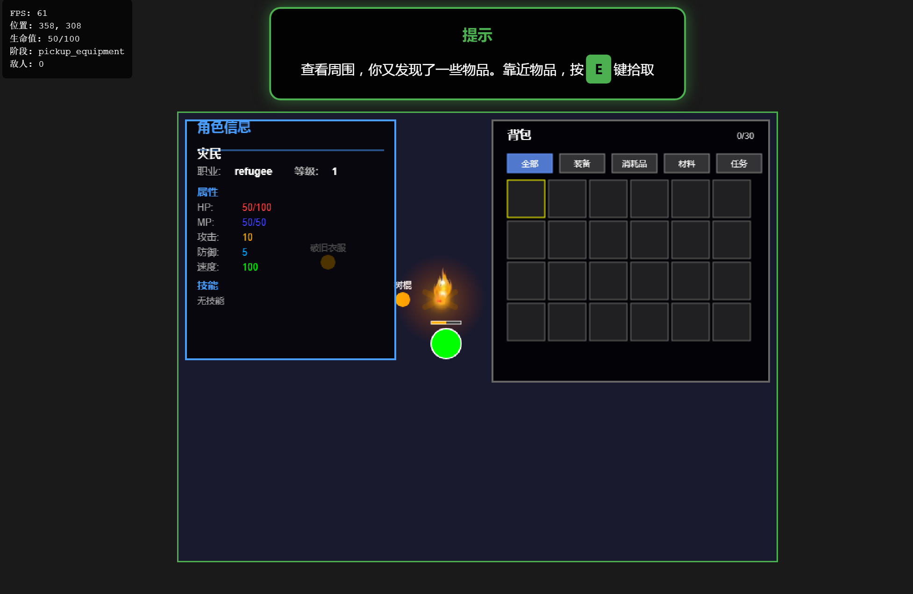
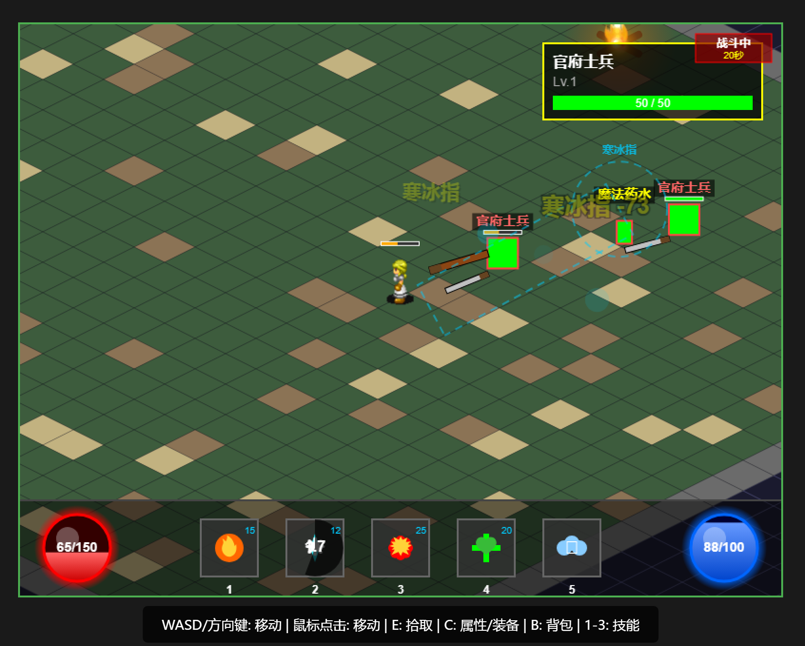

# 张角黄巾起义序章 - HTML5 MMRPG

一个基于完整 ECS 架构的 HTML5 多人在线角色扮演游戏。




## 🎮 立即开始

### 快速启动

1. 克隆项目
   ```bash
   git clone https://gitee.com/coderaaa/html5-mmrgp-game.git 
   或 
   git clone https://github.com/beiliwenxiao/html5-mmrgp-game.git

   cd html5-mmrgp-game
   ```

2. 安装依赖
   ```bash
   npm install
   ```

3. 启动开发服务器
   ```bash
   npm run dev
   ```

4. 打开浏览器访问 Vite 提示的地址（默认 `http://localhost:5173`）

### 或者直接打开

直接在浏览器中打开 `index.html` 文件即可开始游戏（部分功能可能受限于跨域策略）。

## 📖 游戏介绍

### 故事背景

东汉末年，天下大乱。你是一名饥寒交迫的灾民，在绝望中遇到了张角。他给了你一碗粥，一个希望，以及改变命运的机会...

### 六幕剧情

- 第一幕 - 绝望的开始：角色创建、移动/拾取/装备/战斗教程，与野狗、官府士兵、土匪战斗
- 第二幕 - 张角的召唤：加入黄巾军，学习新技能，接受任务
- 第三幕 - 黄巾初起：参与起义战斗，招募 NPC，组建队伍
- 第四幕 - 烽火连天：大规模战斗，攻城略地
- 第五幕 - 风云变幻：阵营抉择，剧情分支
- 第六幕 - 序章终章：最终决战，序章收尾

## 🎯 游戏特性

### ECS 架构

- Entity-Component-System 高性能游戏架构
- 模块化设计，易于扩展和维护
- 核心系统与游戏逻辑分离

### 核心系统

| 系统 | 说明 |
|------|------|
| InputManager | 统一输入处理（键盘、鼠标、触摸） |
| Camera | 智能相机（跟随、边界、坐标转换） |
| SceneManager | 场景管理与切换 |
| AssetManager | 资源加载与管理 |
| AudioManager | 音频播放与管理 |
| PerformanceMonitor | 性能监控 |
| ObjectPool | 对象池，减少 GC 压力 |

### 游戏系统

| 系统 | 说明 |
|------|------|
| CombatSystem | 战斗系统（目标选择、伤害计算、技能） |
| MovementSystem | 移动系统（WASD、点击移动） |
| EquipmentSystem | 装备系统（穿戴、属性计算） |
| DialogueSystem | 对话系统（NPC 对话、剧情） |
| TutorialSystem | 教程系统（渐进式引导） |
| QuestSystem | 任务系统（主线、支线） |
| ClassSystem | 职业系统 |
| SkillTreeSystem | 技能树系统 |
| AttributeSystem | 属性系统 |
| ShopSystem | 商店系统 |
| NPCRecruitmentSystem | NPC 招募系统 |
| UnitSystem | 兵种系统 |
| StatusEffectSystem | 状态效果系统 |
| ElementSystem | 元素系统 |
| EnhancementSystem | 强化系统 |
| AISystem | AI 行为系统 |
| LootSystem | 掉落系统 |
| MapSystem | 地图系统 |
| TeamSystem | 组队系统 |
| GuildSystem | 公会系统 |
| FriendSystem | 好友系统 |
| ChatSystem | 聊天系统 |
| EventSystem | 事件系统 |
| DungeonSystem | 副本系统 |
| PVPSystem | PVP 系统 |
| TalentSystem | 天赋系统 |
| ProgressManager | 进度管理 |

### 渲染系统

| 系统 | 说明 |
|------|------|
| RenderSystem | 渲染系统（视锥剔除、批量渲染） |
| Camera | 相机系统 |
| CombatEffects | 战斗特效（伤害数字、攻击特效） |
| SkillEffects | 技能特效 |
| ParticleSystem | 粒子系统 |
| IsometricRenderer | 等距渲染 |
| AnimationManager | 动画管理 |
| SpriteRenderer | 精灵渲染 |
| WeaponRenderer | 武器渲染 |

### UI 组件

| 组件 | 说明 |
|------|------|
| DialogueBox | 对话框 |
| InventoryPanel | 背包面板 |
| EquipmentPanel | 装备面板 |
| AttributePanel | 属性面板 |
| PlayerInfoPanel | 角色信息面板 |
| SkillTreePanel | 技能树面板 |
| SkillBar | 技能栏 |
| ShopPanel | 商店面板 |
| QuestPanel | 任务面板 |
| MapPanel | 地图面板 |
| Minimap | 小地图 |
| ChatPanel | 聊天面板 |
| NotificationSystem | 通知系统 |
| TutorialTooltip | 教程提示 |
| HealthBar / ManaBar | 生命值/法力值条 |
| StatusEffectBar | 状态效果栏 |
| FloatingText | 浮动文字 |
| PickupPrompt | 拾取提示 |

## 🎮 控制方式

### 键盘

| 按键 | 功能 |
|------|------|
| W / ↑ | 向上移动 |
| S / ↓ | 向下移动 |
| A / ← | 向左移动 |
| D / → | 向右移动 |
| E | 拾取物品 |
| C | 属性/装备面板 |
| B | 背包 |
| 空格 | 攻击 |
| 1-3 | 使用技能 |
| ESC | 暂停/菜单 |

### 鼠标

- 左键点击：移动到目标位置
- 右键点击：选择目标（战斗）

### 触摸（移动端）

- 点击：移动到目标位置
- 长按：选择目标

## 🏗️ 项目结构

```
.
├── index.html                 # 主入口文件
├── vite.config.js             # Vite 配置
├── package.json               # 项目配置
├── src/
│   ├── main.js               # 游戏主程序
│   ├── core/                 # 核心引擎
│   │   ├── GameEngine.js
│   │   ├── InputManager.js
│   │   ├── SceneManager.js
│   │   ├── AssetManager.js
│   │   ├── AudioManager.js
│   │   ├── PerformanceMonitor.js
│   │   ├── ObjectPool.js
│   │   └── ...
│   ├── ecs/                  # ECS 架构
│   │   ├── Entity.js
│   │   ├── Component.js
│   │   ├── EntityFactory.js
│   │   └── components/      # 组件定义
│   ├── systems/              # 游戏系统
│   │   ├── CombatSystem.js
│   │   ├── MovementSystem.js
│   │   ├── EquipmentSystem.js
│   │   ├── DialogueSystem.js
│   │   ├── TutorialSystem.js
│   │   ├── QuestSystem.js
│   │   ├── ClassSystem.js
│   │   ├── SkillTreeSystem.js
│   │   ├── ShopSystem.js
│   │   ├── AISystem.js
│   │   └── ...（30+ 系统）
│   ├── rendering/            # 渲染系统
│   │   ├── Camera.js
│   │   ├── RenderSystem.js
│   │   ├── CombatEffects.js
│   │   ├── ParticleSystem.js
│   │   ├── IsometricRenderer.js
│   │   └── ...
│   ├── ui/                   # UI 组件
│   │   ├── DialogueBox.js
│   │   ├── InventoryPanel.js
│   │   ├── EquipmentPanel.js
│   │   ├── SkillTreePanel.js
│   │   ├── ShopPanel.js
│   │   └── ...（25+ 组件）
│   ├── scenes/               # 通用场景
│   │   ├── LoginScene.js
│   │   ├── CharacterScene.js
│   │   └── GameScene.js
│   ├── data/                 # 数据层
│   │   ├── ItemData.js
│   │   ├── EquipmentData.js
│   │   └── MockDataService.js
│   ├── network/              # 网络通信
│   │   ├── NetworkManager.js
│   │   ├── WebSocketClient.js
│   │   └── MockWebSocket.js
│   └── prologue/             # 序章（配置驱动）
│       ├── PrologueManager.js
│       ├── config/           # 配置文件
│       ├── conditions/       # 条件函数
│       ├── data/             # 剧情数据（Act1-6 JSON）
│       ├── entities/         # 序章实体
│       ├── scenes/           # 场景类（Act1-6）
│       ├── systems/          # 序章专用系统
│       └── ui/               # 序章专用 UI
├── styles/                   # 样式文件
│   └── main.css
├── assets/                   # 游戏资源
│   └── audio/                # 音频资源
├── test/                     # 测试文件（60+ 测试页面）
├── docs/                     # 项目文档
└── images/                   # 截图
```

## 📚 文档

### 快速开始

- [快速启动指南](docs/QUICK_START_ECS.md)

### 架构文档

- [游戏核心架构](docs/GAME_CORE_ARCHITECTURE.md)
- [引擎特性](docs/ENGINE_FEATURES.md)
- [ECS 快速入门](docs/QUICK_START_ECS.md)
- [Prologue 重构指南](docs/PROLOGUE_REFACTOR_GUIDE.md)
- [重构总结](docs/REFACTOR_SUMMARY.md)

### 系统文档

- [战斗系统](docs/TASK_8_COMBAT_SYSTEM_COMPLETE.md)
- [大规模战斗](docs/LARGE_SCALE_COMBAT_IMPLEMENTATION.md)
- [职业系统](docs/CLASS_SYSTEM.md)
- [属性系统](docs/ATTRIBUTE_SYSTEM_IMPLEMENTATION.md)
- [元素系统](docs/ELEMENT_SYSTEM_IMPLEMENTATION.md)
- [强化系统](docs/ENHANCEMENT_SYSTEM.md)
- [技能树系统](docs/SKILL_TREE_SYSTEM_IMPLEMENTATION.md)
- [状态效果系统](docs/STATUS_EFFECT_SYSTEM_IMPLEMENTATION.md)
- [兵种系统](docs/UNIT_SYSTEM_IMPLEMENTATION.md)
- [商店系统](docs/SHOP_SYSTEM.md)
- [任务追踪](docs/QUEST_TRACKER_IMPLEMENTATION.md)
- [NPC 招募系统](docs/NPC_RECRUITMENT_SYSTEM_IMPLEMENTATION.md)
- [对话框](docs/DIALOGUE_BOX_IMPLEMENTATION.md)
- [UI 系统](docs/UI_SYSTEM_GUIDE.md)

### 场景文档

- [序章实现](docs/PROLOGUE_IMPLEMENTATION.md)
- [第一幕实现](docs/ACT1_SCENE_IMPLEMENTATION.md)
- [第二幕实现](docs/ACT2_SCENE_IMPLEMENTATION.md)

### 其他

- [性能优化指南](docs/PERFORMANCE_OPTIMIZATION_GUIDE.md)
- [故障排除](docs/TROUBLESHOOTING.md)
- [ECS 架构](src/ecs/README.md)
- [网络模块](src/network/README.md)
- [渲染模块](src/rendering/README.md)
- [UI 模块](src/ui/README.md)
- [系统模块](src/systems/README.md)

## 🔧 开发

### 环境要求

- Node.js 14+
- npm 或 yarn

### 常用命令

```bash
npm install          # 安装依赖
npm run dev          # 启动 Vite 开发服务器
npm run build        # 构建生产版本
npm run preview      # 预览构建结果
npm test             # 运行单元测试（Vitest）
```

### 调试

```javascript
// 在浏览器控制台中
scene.getGameState()                    // 查看游戏状态
scene.playerEntity                      // 查看玩家实体
scene.entities                          // 查看所有实体
scene.camera.position                   // 查看相机位置
scene.renderSystem.setDebugMode(true)   // 开启调试模式
```

## 🚀 性能

### 目标

- FPS: 60（稳定）
- 实体数量: 100+
- 内存使用: < 100MB
- 加载时间: < 3秒

### 优化措施

- 视锥剔除：只渲染可见实体
- 对象池：减少 GC 压力
- 批量渲染：提高渲染效率
- 离屏 Canvas：缓存静态内容
- 粒子系统优化

## 🗺️ 路线图

### 已完成 ✅

- [x] 完整的 ECS 架构
- [x] 核心引擎系统（输入、相机、场景管理、资源管理）
- [x] 六幕序章场景（Act1 - Act6）
- [x] 教程系统（基础教程 + 渐进式提示）
- [x] 战斗系统（实时战斗、技能、大规模战斗）
- [x] 装备与背包系统
- [x] 职业与技能树系统
- [x] 属性与状态效果系统
- [x] 元素与强化系统
- [x] 商店系统
- [x] 任务系统
- [x] NPC 招募系统
- [x] 兵种系统
- [x] 对话系统
- [x] 粒子特效系统
- [x] 渲染优化（视锥剔除、批量渲染）
- [x] 网络通信模块（WebSocket）
- [x] AI 系统
- [x] 副本系统
- [x] 社交系统（好友、公会、组队、聊天）

### 进行中 🚧

- [ ] 音效资源集成
- [ ] UI 系统持续完善
- [ ] 性能持续优化

### 计划中 📋

- [ ] 网络多人联机功能
- [ ] PVP 实战对接
- [ ] 更多剧情内容
- [ ] 移动端适配优化

## 🤝 贡献

欢迎贡献代码！请遵循以下步骤：

1. Fork 项目
2. 创建特性分支 (`git checkout -b feature/AmazingFeature`)
3. 提交更改 (`git commit -m 'Add some AmazingFeature'`)
4. 推送到分支 (`git push origin feature/AmazingFeature`)
5. 开启 Pull Request

### 代码规范

- 使用 ES6+ 语法
- 类名使用 PascalCase
- 方法和变量使用 camelCase
- 常量使用 UPPER_SNAKE_CASE
- 添加 JSDoc 注释
- 遵循 ECS 架构

## 📄 许可证

本项目采用 MIT 许可证 - 查看 [LICENSE](LICENSE) 文件了解详情。

### 使用的技术

- HTML5 Canvas - 游戏渲染
- ES6+ JavaScript - 现代 JavaScript
- ECS 架构 - 高性能游戏架构
- Vite - 构建工具
- Vitest - 单元测试框架
- WebSocket - 多人在线通信

---

项目状态: 活跃开发中
当前版本: 1.0.0
最后更新: 2026-02-22
